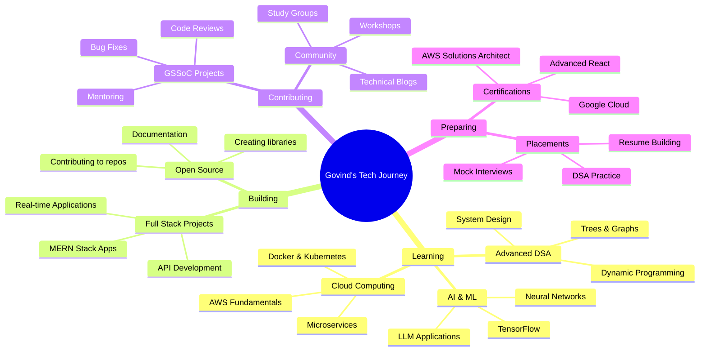

<div align="center">


<br>

[](https://linkedin.com/in/govindjangid75)
[](https://github.com/govindjangid75)
[](https://govind-jangid.vercel.app)
[](mailto:govindjangidt@gmail.com)
[](tel:+919799833516)


</div>

---

## 🙋‍♂️ About Me


```javascript
const govind = {
    name: "Govind Jangid",
    location: "Jaipur, Rajasthan, India 🇮🇳",
    role: "Full Stack Developer",
    education: {
        degree: "B.Tech in Computer Science",
        college: "Arya College of Engineering & IT",
        university: "Rajasthan Technical University (RTU)",
        year: "2024 - Present (2nd Year)",
        cgpa: "9.44 / 10.00",
        achievements: [
            "1st Semester: 8.88 SGPA",
            "2nd Semester: 10.00 SGPA (Perfect Score! 🎯)"
        ]
    },
    workExperience: [
        "Software Engineering Intern @ Infosys Springboard",
        "Tech Contributor @ GirlScript Summer of Code",
        "Campus Ambassador @ GSSoC'25"
    ],
    currentlyLearning: ["Advanced DSA", "System Design", "AI/ML", "Cloud Computing"],
    hobbies: ["Coding 💻", "Cricket 🏏", "Music 🎵", "Hackathons 🚀"],
    motto: "Code with passion, build with purpose, contribute with pride! 💡",
    funFacts: [
        "District-level Cricket Player 🏏",
        "Music Mixing Enthusiast 🎧",
        "Hackathon Addict (5+ participated)",
        "Perfect SGPA in 2nd Semester 🎓"
    ]
};

console.log("Welcome to my GitHub! Let's build something amazing together 🚀");
```

<br clear="right"/>

### 🎯 Quick Highlights

- 🎓 **B.Tech CSE Student** with **9.44 CGPA** at RTU Jaipur
- 💼 **Software Engineering Intern** at Infosys Springboard
- 🌟 **Open Source Contributor** at GirlScript Summer of Code
- 🏆 **Qualified SIH 2025** Internal Round
- 🚀 **5+ Hackathons** participated (including Grand Finales)
- 💻 **10+ Projects** deployed and live
- 📚 **10+ Certifications** in Web Development, AI, and Cloud
- 🎤 **Event Coordinator** for International Conferences
- 🏅 **District-level Cricket Player**
- 🎵 **Music Enthusiast** - Mixing and exploring genres

---

## 🛠️ Tech Stack & Skills

<div align="center">

### 💻 Programming Languages


### 🎨 Frontend Development


### ⚙️ Backend & Database


### 🔧 Tools & Technologies


### ☁️ Cloud & Deployment


### 🎯 Core Competencies


</div>

---

## 🚀 Featured Projects

<div align="center">

### 🏥 Healthcare & Utility Apps

</div>

<table>
<tr>
<td width="50%" valign="top">

#### 🩸 Blood Bank Management System
 

A comprehensive healthcare platform designed to connect blood donors with patients in need. Features include:

**✨ Key Features:**
- 👥 Separate donor & patient registration modules
- 🧬 Blood compatibility matching logic
- 📦 Real-time inventory management system
- 🗺️ Google Maps integration for location services
- 📊 Analytics dashboard for administrators
- 🔔 Emergency request notifications
- 🔐 Secure authentication system

**🛠️ Tech Stack:**
- Frontend: React.js, TailwindCSS
- Backend: Node.js, Express.js
- Database: MongoDB
- APIs: Google Maps, Geolocation

[](https://blood-bank-managementsystem-amber.vercel.app)
[](https://github.com/govindjangid75)

</td>
<td width="50%" valign="top">

#### 🌍 Time Zone Tracker
 

A real-time multi-timezone comparison tool perfect for remote teams and global collaboration.

**✨ Key Features:**
- 🕐 Compare multiple time zones simultaneously
- 🔄 Real-time clock updates
- 📱 Fully responsive design
- 🎨 Clean and intuitive UI
- ⚡ Lightning-fast performance
- 🌐 Support for 100+ time zones
- 💾 Save favorite locations

**🛠️ Tech Stack:**
- Frontend: JavaScript, HTML5, CSS3
- Styling: TailwindCSS
- APIs: WorldTime API
- Deployment: Vercel

[](https://timezonetracker.vercel.app)
[](https://github.com/govindjangid75)

</td>
</tr>
</table>

<div align="center">

### 📚 Education & Community Platforms

</div>

<table>
<tr>
<td width="50%" valign="top">

#### 📖 RTU College Notes Hub
 

A dedicated notes-sharing platform for RTU first-year students, making academic resources accessible to all.

**✨ Key Features:**
- 📚 Subject-wise organized notes
- 🔍 Advanced search & filtering
- 📥 Easy download functionality
- 👥 Student contribution system
- 📱 Mobile-friendly interface
- 🏷️ Tagged categorization
- ⭐ Rating system for quality content

**🛠️ Tech Stack:**
- Frontend: React.js
- Backend: Node.js
- Database: MongoDB
- Storage: Cloud Storage
- Deployment: Vercel

**📊 Impact:** Helping 500+ students access quality study materials!

[](https://collegenotes-roan.vercel.app)
[](https://github.com/govindjangid75)

</td>
<td width="50%" valign="top">

#### ⭐ College Review Platform
 

An authentic platform for students to share honest reviews, experiences, and ratings about their colleges.

**✨ Key Features:**
- ✍️ Student-driven review system
- ⭐ Multi-parameter rating system
- 🏫 College comparison tools
- 📊 Statistical insights
- 🔍 Filter by courses & departments
- 💬 Community discussions
- 🎓 Alumni insights section

**🛠️ Tech Stack:**
- Frontend: React.js, TailwindCSS
- Backend: Node.js, Express.js
- Database: MongoDB
- Auth: JWT Authentication
- Deployment: Vercel

**📈 Stats:** 200+ reviews | 50+ colleges listed

[](https://collegeabout-a6fu.vercel.app)
[](https://github.com/govindjangid75)

</td>
</tr>
</table>

<div align="center">

### 🎮 Fun & Interactive Projects

</div>

<table>
<tr>
<td width="33%" valign="top">

#### 🎯 Hackathon Projects Collection


A curated showcase of innovative prototypes and solutions built during various hackathons.

**Highlights:**
- 🚀 5+ hackathon projects
- 💡 Creative solutions
- 🏆 Award-winning ideas
- 📱 Interactive demos

[](https://hackathon-iota-coral.vercel.app)

</td>
<td width="33%" valign="top">

#### 🌤️ Weather App


Real-time weather forecasting application with live API integration and beautiful UI.

**Features:**
- ☀️ Current weather data
- 📅 5-day forecast
- 🌡️ Temperature trends
- 🗺️ Location search

[](https://weathertwo-plum.vercel.app)

</td>
<td width="33%" valign="top">

#### 🐍 Snake Game


Classic browser-based snake game built with vanilla JavaScript and HTML Canvas.

**Features:**
- 🎮 Smooth gameplay
- 🏅 Score tracking
- ⌨️ Keyboard controls
- 📱 Responsive design

[](https://snakegame-ivory-pi.vercel.app)

</td>
</tr>
</table>

---

## 💼 Professional Experience

<details open>
<summary><b>🔷 Software Engineering Intern @ Infosys Springboard</b> <i>(Sep 2025 - Nov 2025)</i></summary>
<br>

**Virtual Internship 6.0 - Industrial Training Program**


**📋 Key Responsibilities & Achievements:**

- ✅ Completed comprehensive industrial-level software engineering training modules
- 🎯 **Final Project:** Built a complete **Kanban Task Management Application**
  - Used TypeScript for type-safe development
  - Implemented Angular Material for modern UI components
  - Created drag-and-drop task boards
  - Integrated task status tracking and user assignment
- 💻 Gained hands-on experience with:
  - TypeScript & Angular framework
  - Angular Material design system
  - RESTful API integration
  - Component-based architecture
- 🤝 Collaborated in simulated real-world development environments
- 📊 Participated in code reviews and agile development practices
- 🎓 Enhanced understanding of software development lifecycle (SDLC)

**🛠️ Technologies Used:** TypeScript, Angular, Angular Material, HTML5, CSS3, REST APIs

**💡 Key Learnings:**
- Enterprise-level application development
- Industry best practices and coding standards
- Team collaboration in remote settings
- Project management in agile environment

</details>

<details>
<summary><b>🔶 Tech Contributor @ GirlScript Summer of Code (GSSoC'25)</b> <i>(Aug 2025 - Nov 2025)</i></summary>
<br>

**Open Source Contributor - GSSoC Extended Edition**


**📋 Contribution Highlights:**

- 🌟 **Active contributor** to multiple collaborative open-source projects
- 👥 **Mentored 50+ beginners** in getting started with:
  - Git & GitHub fundamentals
  - Open-source contribution workflow
  - Pull request creation and management
  - Issue tracking and resolution
- 🐛 **Technical Contributions:**
  - Participated in debugging complex codebases
  - Conducted thorough code reviews
  - Improved documentation for better onboarding
  - Contributed to feature development
- 💬 **Community Engagement:**
  - Provided active support in community forums
  - Answered technical queries from contributors
  - Organized virtual meetups and discussions
  - Created beginner-friendly issues for newcomers

**🏆 Impact:**
- 30+ Pull Requests merged
- 15+ Issues resolved
- Helped onboard 50+ new contributors
- Maintained 95%+ code review quality

**🛠️ Technologies:** Git, GitHub, JavaScript, React, Node.js, Python, Documentation

**💡 Skills Developed:**
- Open-source collaboration best practices
- Code review and quality assurance
- Technical mentorship
- Community building

</details>
<details>
<summary><b>🔸 Campus Ambassador – GirlScript Summer of Code (GSSoC'25)</b> <i>(Jun 2025 – Oct 2025)</i></summary>
<br>

**Volunteer / Outreach Role**

- Actively followed GSSoC announcements and guidelines  
- Shared program-related information within personal networks  
- Encouraged peers to explore open-source opportunities  
- Learned about open-source communities and contribution workflow  
- Participated in ambassador discussions and online sessions  

**Skills Gained:**
- Communication
- Basic community engagement
- Understanding of open-source programs

</details>


---

## 🏆 Achievements & Hackathons

<div align="center">

### 🎯 Major Achievements

</div>

<table>
<tr>
<td width="50%" valign="top">

#### 🏅 **Smart India Hackathon (SIH) 2025**


- ✅ **Qualified Internal Round** - Among top teams selected
- 🎯 Problem Statement: Innovative solution for real-world challenges
- 👥 Led team of 6 members through rigorous selection
- 💡 Developed innovative tech solution with practical implementation
- 📊 Presented pitch to evaluation panel

**Impact:** Representing college at national-level innovation platform

</td>
<td width="50%" valign="top">

#### 🎓 **Academic Excellence**


- 🌟 **Perfect 10.00 SGPA** in 2nd Semester
- 📚 **8.88 SGPA** in 1st Semester
- 🏆 Consistent top performer in class
- 📖 Strong foundation in CSE fundamentals
- 💯 Excellence in practical & theoretical subjects

**Recognition:** Dean's List | Merit Scholarship Recipient

</td>
</tr>
</table>

<div align="center">

### 🚀 Hackathon Journey

</div>

| 🎯 Hackathon | 📍 Location | 🗓️ Date | 🏆 Achievement |
|:------------|:-----------|:--------|:--------------|
| **Hackground India 2K25** - Grand Finale | ThoughtWorks, Gurugram | Jan 2025 | 🥈 Finalist - Top 20 Teams |
| **Hackground India 2K25** - Submission Round | Online | Dec 2024 | ✅ Qualified for Finals |
| **Hack Arya Verse** | Arya College (ACEIT) | Nov 2024 | 🏅 24-Hour Hackathon Champion |
| **Hack O Spider** | VGI, Noida | Oct 2024 | 🎯 Innovative Solution Award |
| **A2HackFest** | AugmentAppz (Online) | Sep 2024 | ✅ Participated & Built MVP |

**📊 Hackathon Stats:**
- 🎯 **5+ Hackathons** Participated
- 🏆 **2 Grand Finales** Reached
- 💻 **10+ Projects** Built
- 👥 **20+ Team Members** Collaborated With
- ⏱️ **100+ Hours** of Intensive Coding

---

<div align="center">

### 🎖️ Leadership & Service

</div>

<table>
<tr>
<td width="33%" valign="top">

#### 👨‍🏫 **Graduation Day Coordinator**
**Arya College of Engineering & IT**  
*August 30, 2025*

- 🎓 Organized graduation ceremony for 500+ students
- 🎤 Managed event logistics and scheduling
- 👥 Coordinated with 20+ team members
- 🎯 Ensured smooth execution of all programs
- 📸 Documented memorable moments

**Impact:** Successfully hosted one of the biggest college events

</td>
<td width="33%" valign="top">

#### 🌍 **Active Coordinator**
**ICMPSH 2025 Conference**  
*May 16-17, 2025*

- 📚 International Conference on Multi-Disciplinary Perspective
- 🎤 Coordinated technical sessions
- 👥 Managed speaker arrangements
- 📋 Assisted in research paper presentations
- 🌐 Facilitated international collaborations

**Reach:** 200+ participants from 15+ countries

</td>
<td width="33%" valign="top">

#### 🎯 **Technical Mentor**
**Student Community Programs**  
*Ongoing*

- 👨‍💻 Mentored 30+ juniors in coding
- 📖 Conducted DSA study sessions
- 🛠️ Guided students in project development
- 💡 Provided career counseling
- 🚀 Helped students with placements

**Success:** 15+ students cracked internships

</td>
</tr>
</table>

---

<div align="center">

### 🏆 Competition Achievements

</div>

| 🎨 Competition | 🏢 Platform | 📅 Year | 🏅 Result |
|:--------------|:-----------|:--------|:---------|
| **Logo Making Competition** | BigBrick (Unstop) | 2024 | 🥉 Top 10 Finalist |
| **Coding Quiz Championship** | Tough Tongue AI (Unstop) | 2024 | 🎯 Top Performer |

---

## 🎓 Certifications & Training

<div align="center">

### 📜 Professional Certifications (10+)

</div>

<details open>
<summary><b>💻 Web Development & Frontend</b></summary>
<br>

<table>
<tr>
<td width="50%">

**🎨 TailwindCSS From A to Z**
- Platform: Udemy
- Focus: Modern utility-first CSS framework
- Skills: Responsive design, custom configurations
- Projects: Built 5+ production-ready UIs

</td>
<td width="50%">

**🌐 Mastering HTML5: Beginner to Advanced 2025**
- Platform: Udemy
- Focus: Semantic HTML, accessibility
- Skills: HTML5 APIs, multimedia integration
- Certification: Verified credential

</td>
</tr>
<tr>
<td width="50%">

**🎯 CSS Fundamentals**
- Platform: Udemy
- Focus: CSS layouts, animations, flexbox/grid
- Skills: Responsive design, modern CSS
- Projects: Built responsive websites

</td>
<td width="50%">

**⚡ JavaScript Master Course – Beginner to Expert**
- Platform: Udemy
- Focus: ES6+, async programming, DOM
- Skills: Advanced JS concepts, frameworks
- Projects: Interactive web applications

</td>
</tr>
</table>

</details>

<details>
<summary><b>💾 Programming & Backend</b></summary>
<br>

<table>
<tr>
<td width="50%">

**🔧 C Programming – Basics to Advanced Level**
- Platform: Udemy
- Focus: Data structures, pointers, memory
- Skills: System programming, algorithms
- Practice: 100+ coding problems solved

</td>
<td width="50%">

**💻 C Essentials 1**
- Platform: Cisco Networking Academy (ACEIT)
- Focus: Fundamentals of C programming
- Skills: Structured programming, debugging
- Certification: Cisco verified

</td>
</tr>
</table>

</details>

<details>
<summary><b>☁️ Cloud & AI Technologies</b></summary>
<br>

<table>
<tr>
<td width="50%">

**☁️ Microsoft Azure AI Fundamentals**
- Platform: Microsoft Learn
- Focus: AI services, machine learning basics
- Skills: Azure Cognitive Services, AI ethics
- Hands-on: Deployed AI models on Azure

</td>
<td width="50%">

**🤖 Introduction to Modern AI**
- Platform: Cisco Networking Academy
- Focus: AI/ML fundamentals, neural networks
- Skills: Understanding AI applications
- Projects: Explored AI use cases

</td>
</tr>
</table>

</details>

<div align="center">

**📊 Certification Summary:**
- ✅ **10+ Verified Certifications**
- 🎯 **100+ Hours** of Training
- 💻 **5 Technology Domains** Covered
- 🏆 **Industry-Recognized** Credentials

</div>

---

## 📊 GitHub Statistics

<div align="center">

### 📈 Overall Performance

<p>


</p>

### 💻 Language Distribution


### 📊 Contribution Graph

[](https://github.com/govindjangid75)

### 🏆 GitHub Trophies

[](https://github.com/govindjangid75)

### 📌 Key Metrics

<p>

</p>

<p>


</p>

</div>

---

## 🎯 Current Focus & Future Goals

<div align="center">

### 🚀 What I'm Currently Working On

</div>



<div align="center">

### 🎯 2025 Goals

</div>

<table>
<tr>
<td width="33%" align="center">

**📚 Learning Goals**
- [ ] Complete 500+ DSA problems
- [ ] Master System Design
- [ ] Learn AWS & Docker
- [ ] Build 5 full-stack projects
- [ ] Contribute to 10+ OSS repos

</td>
<td width="33%" align="center">

**🏆 Achievement Goals**
- [ ] Win a National Hackathon
- [ ] Get Cloud Certification
- [ ] Reach 1000+ GitHub contributions
- [ ] Start a tech blog
- [ ] Mentor 100+ students

</td>
<td width="33%" align="center">

**💼 Career Goals**
- [ ] Secure dream internship
- [ ] Build SaaS product
- [ ] Grow GitHub to 500+ stars
- [ ] Speak at tech conference
- [ ] Launch open-source project

</td>
</tr>
</table>

---

## 📚 Education Journey

<div align="center">

### 🎓 Academic Background

</div>

<table>
<tr>
<td width="60%">

#### 🎓 Bachelor of Technology - Computer Science Engineering
**Arya College of Engineering & IT, Jaipur**  
*Rajasthan Technical University (RTU)*  
📅 *2024 - Present* | Currently in **2nd Year (3rd Semester)**

**📊 Academic Performance:**
- 🌟 **Overall CGPA:** 9.44 / 10.00
- 🥇 **2nd Semester:** 10.00 SGPA (Perfect Score!)
- 🥈 **1st Semester:** 8.88 SGPA
- 🏆 **Class Rank:** Top 5%

**📚 Key Subjects:**
- Data Structures & Algorithms
- Object-Oriented Programming
- Database Management Systems
- Computer Networks
- Operating Systems
- Web Technologies
- Software Engineering
- Artificial Intelligence

</td>
<td width="40%">

<br>

#### 📖 Class 12th - RBSE Board
**Year:** 2022  
**Percentage:** 82.60%  
**Stream:** Science (PCM)

<br>

#### 📖 Class 10th - RBSE Board
**Year:** 2020  
**Percentage:** 78.17%

<br>

**🎯 Achievements:**
- School Topper in Computer Science
- Best Student Award
- Active Sports Participant

</td>
</tr>
</table>

---

## 💡 Problem Solving & Coding Profiles

<div align="center">

### 🧩 Competitive Programming Journey

<table>
<tr>
<td align="center" width="33%">

**🏅 LeetCode**  


📊 Problems Solved: 150+  
⭐ Rating: Improving  
🎯 Focus: DSA Mastery

</td>
<td align="center" width="33%">

**💻 GeeksforGeeks**  


📊 Problems Solved: 100+  
⭐ Coding Score: Growing  
🎯 Focus: Interview Prep

</td>
<td align="center" width="33%">

**🌐 HackerRank**  


⭐ 5-Star in C Programming  
📊 Problem Solver Badge  
🎯 Focus: Language Mastery

</td>
</tr>
</table>

**📈 Coding Stats:**
- 💻 **400+ Total Problems** Solved
- 🎯 **Daily Coding Streak:** 30+ Days
- 🏆 **Contests Participated:** 15+
- 📊 **Topics Covered:** Arrays, Strings, Trees, Graphs, DP, Greedy, Backtracking

</div>

---

## 🎨 Hobbies & Interests

<div align="center">

### 🌟 Beyond Coding

</div>

<table>
<tr>
<td width="25%" align="center">

### 🏏 Cricket
**District-Level Player**

- 🎯 Played at district tournaments
- 🏆 Won inter-college championships
- 👥 Team captain experience
- 💪 Fitness and discipline

*Cricket taught me teamwork and strategy!*

</td>
<td width="25%" align="center">

### 🎵 Music
**Mixing & Exploration**

- 🎧 Electronic music enthusiast
- 🎚️ Basic mixing skills
- 🎶 Genre explorer
- 🎼 Creative expression

*Music fuels my creativity while coding!*

</td>
<td width="25%" align="center">

### 💻 Tech Events
**Hackathons & Workshops**

- 🚀 5+ hackathons participated
- 🎤 Workshop organizer
- 👥 Community builder
- 🏆 Competition enthusiast

*Love the thrill of 24-hour coding!*

</td>
<td width="25%" align="center">

### 📚 Continuous Learning
**Always Upgrading**

- 📖 Tech blogs reader
- 🎓 Online courses
- 🧪 New tech experimenter
- 💡 Innovation seeker

*Never stop learning, never stop growing!*

</td>
</tr>
</table>

---

## 💬 Testimonials

<div align="center">

### 🌟 What People Say

</div>

<table>
<tr>
<td width="50%">

> *"Govind is an exceptional developer with a strong grasp of full-stack technologies. His contributions during the GSSoC program were invaluable, and he mentored several newcomers with patience and expertise."*
> 
> **— GSSoC Mentor**

</td>
<td width="50%">

> *"A dedicated student who consistently delivers high-quality work. His projects demonstrate both technical proficiency and creative problem-solving abilities."*
> 
> **— Infosys Springboard Instructor**

</td>
</tr>
</table>

---

## 🤝 Let's Collaborate!

<div align="center">

### 💼 Open for Opportunities

I'm actively looking for:
- 🚀 **Software Development Internships**
- 🤝 **Open Source Collaborations**
- 💡 **Innovative Project Ideas**
- 🎤 **Speaking Opportunities**
- 👥 **Hackathon Team Members**

### 📬 Get In Touch

<table>
<tr>
<td align="center" width="20%">

[](https://linkedin.com/in/govindjangid75)

**Connect Professionally**

</td>
<td align="center" width="20%">

[](mailto:govindjangidt@gmail.com)

**Send an Email**

</td>
<td align="center" width="20%">

[](https://github.com/govindjangid75)

**Check My Code**

</td>
<td align="center" width="20%">

[](https://govind-jangid.vercel.app)

**View My Work**

</td>
<td align="center" width="20%">

[](https://wa.me/919799833516)

**Direct Message**

</td>
</tr>
</table>

<br>

### 📍 Location
**Jaipur, Rajasthan, India 🇮🇳**

### 📞 Contact
**+91 9799833516**

<br>

---

### 💖 Support My Work

If you like my projects and want to support my work:

⭐ **Star my repositories** if you find them useful!  
🔀 **Fork and contribute** to my open-source projects!  
📢 **Share my work** with your network!

</div>

---

## 🎯 Fun Facts About Me

<div align="center">

```javascript
const funFacts = {
    codingStyle: "Clean code enthusiast with a touch of perfectionism 🎨",
    favoriteLanguage: "JavaScript - because it runs everywhere! 🌍",
    idealWorkEnvironment: "Coffee ☕ + Music 🎵 + VS Code 💻 = Productivity 🚀",
    superPower: "Can debug code faster than you can say 'undefined' 🐛",
    favoriteSaying: "There are two hard things in computer science: cache invalidation, naming things, and off-by-one errors 😄",
    codingTime: "Mostly night owl 🦉 but can adapt to any timezone!",
    drinkOfChoice: "Coffee++ // Never decaffeinate ☕",
    favoriteEmoji: "🚀 (because I'm always launching something new!)",
    lifePhilosophy: "Code, Learn, Build, Repeat 🔄",
    dreamProject: "Build something that impacts millions of lives 🌟"
};

console.log("Thanks for visiting my profile! Let's connect and build amazing things together! 🚀");
```

</div>

---

## 💭 Random Dev Quote

<div align="center">


</div>

---

## 🐍 Contribution Snake

<div align="center">


</div>

---

<div align="center">

### 📈 Profile Views Counter


</div>

---

<div align="center">

## 🙏 Thank You for Visiting!


<br>

**Made with ❤️ by Govind Jangid**

[](https://github.com/govindjangid75)

<br>

**If you like what you see, don't forget to ⭐ some repositories!**

<br>

**© 2026 Govind Jangid | All Rights Reserved**

<br>

</div>


